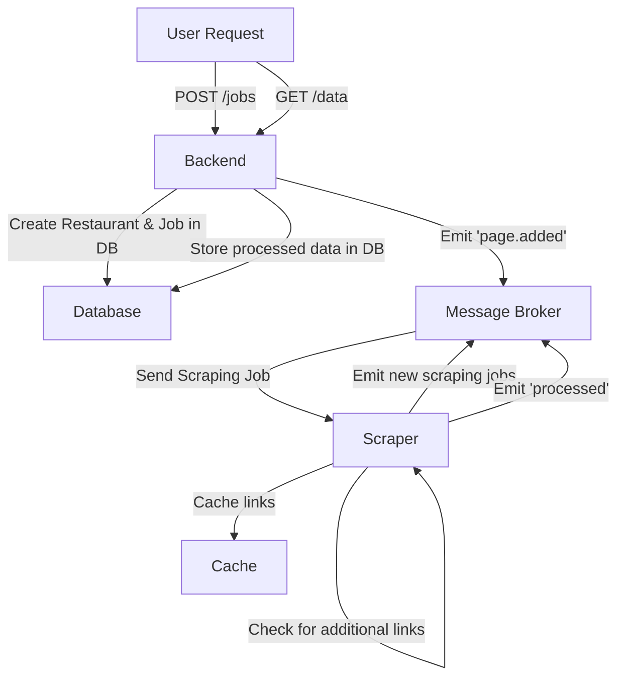
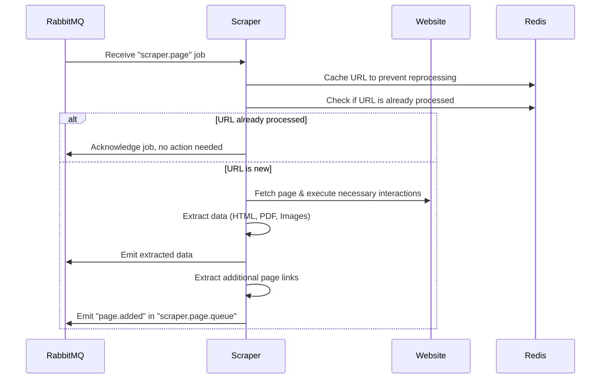
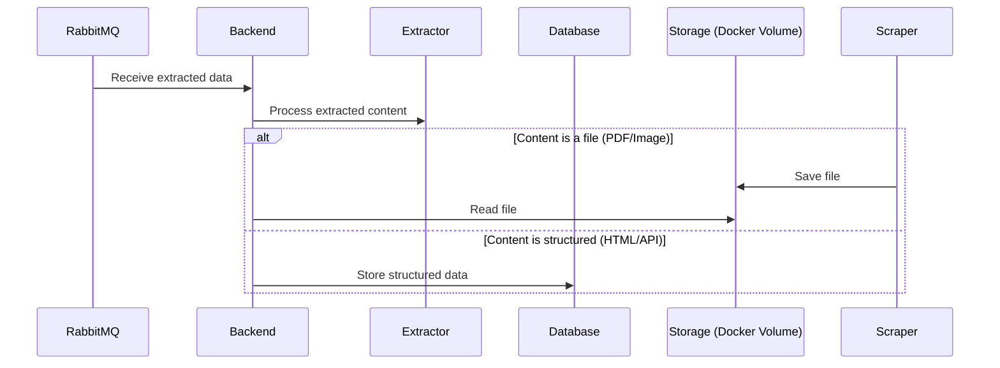

# Food-Craver

## Table of Contents

1. [Features](#features)
2. [Prerequisites](#prerequisites)
3. [Local Production Setup](#local-production-setup)
4. [Local Development Setup](#local-development-setup)
5. [System Architecture](#system-architecture)
   - [High-Level Flow](#high-level-flow)
   - [Scraper Process](#scraper-process)
   - [Backend Processing](#backend-processing)

## Overview

Food-Craver is a **scalable application** consisting of **scrapers, a backend with a REST API, RabbitMQ as a message broker, Redis as a caching layer, and PostgreSQL as the primary database**.

The system extracts menu data from URLs by searching for potential **PDFs, images, and HTML structures**. The scraping pipeline is designed to be **flexible and expandable**, allowing modifications and new extraction strategies to be incorporated as needed.

The **HTML scraper** operates using a **bottom-up approach**, searching for keywords, identifying matching selectors, and then extracting all menu options dynamically. Additionally, it detects further links related to menus and triggers **new scraping jobs** to ensure comprehensive coverage.

## Features

- **Distributed Web Scraping** with **RabbitMQ** for job distribution
- **Headless Browser Automation** using **Puppeteer**
- **Intelligent Content Extraction** supporting **HTML, PDFs, and Images**
- **Caching Layer** with **Redis** to prevent redundant crawling
- **Database Persistence** with **PostgreSQL**
- **Scalable Architecture** with Docker Compose and Microservices
- **Dynamic Page Handling**: Expands scraping coverage by detecting new pages

## API Documentation

Swagger documentation is available at: http://localhost:3000/api

## Prerequisites

### Environment Variables

Ensure a `.env` file is created in the root directory with the following example variables:

```env
UPLOADS_MOUNT_DIR=/app/uploads

BACKEND_IMAGE=food-craver-backend
BACKEND_DIR=packages/backend
BACKEND_EX_PORT=3000

SCRAPER_IMAGE=food-craver-scraper
SCRAPER_DIR=packages/scraper
SCRAPER_PAGE_INSTANCE_QUEUES=page
SCRAPER_SUBPAGE_INSTANCE_QUEUES=page,subpage
SCRAPER_BROKER_URL=amqp://message-broker:5672
SCRAPER_QUEUE=scraper.page

BROKER_IMAGE=food-craver-message-broker
BROKER_DIR=packages/message-broker
BROKER_AMQP_PORT=5672
BROKER_AMQP_EX_PORT=5672
BROKER_UI_PORT=15672
BROKER_UI_EX_PORT=15672
BROKER_USER=food_craver_user
BROKER_PASSWORD=password

DB_IMAGE=food-craver-database
DB_DIR=packages/database
DB_HOST=database
DB_EX_PORT=5555
DB_PORT=5432
DB_NAME=food_craver
DB_USER=food_craver_user
DB_PASSWORD=password

CACHE_IMAGE=food-craver-cache
CACHE_DIR=packages/cache
REDIS_HOST=cache
CACHE_PORT=6379
CACHE_EX_PORT=6379
```

For local **development**, ensure you have the following installed:

- Docker
- Docker Compose
- Yarn
- Node.js (16+ recommended)

For simply running the **production environment**, only Docker and Docker Compose are required.

## Run in production mode

To run the project in **production mode**, use **Docker Compose**:

```sh
docker-compose up
```

## Local Development Setup

To run the project in **development mode**, follow these steps:

```sh
docker compose --file ./docker-compose.dev.yml up
```

Start the backend, scraper, and necessary containers in development mode.

## System Architecture

This section outlines the architecture of the **Food Craver System**, including its overall flow, the scraping process, and backend processing.

### High-Level Flow



### Scraper Process



### Backend Processing


