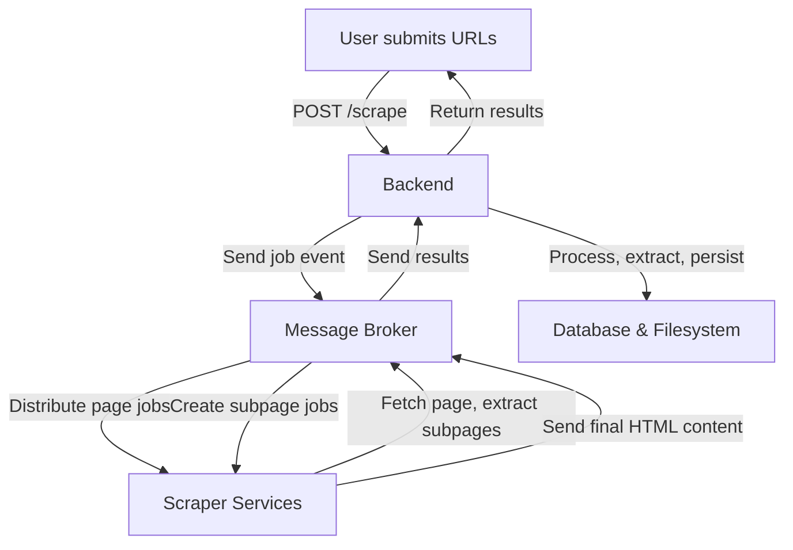
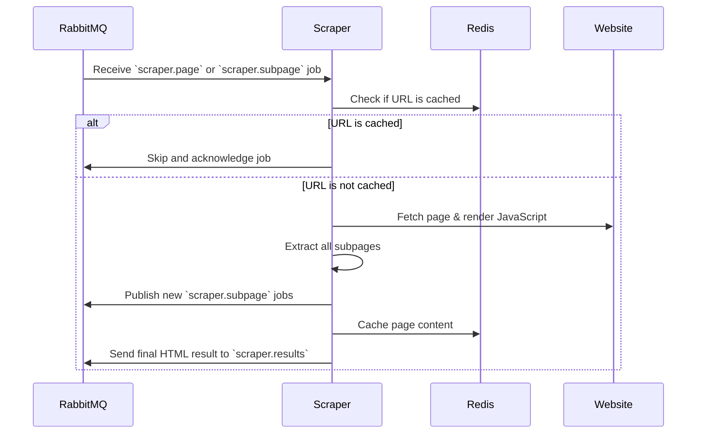
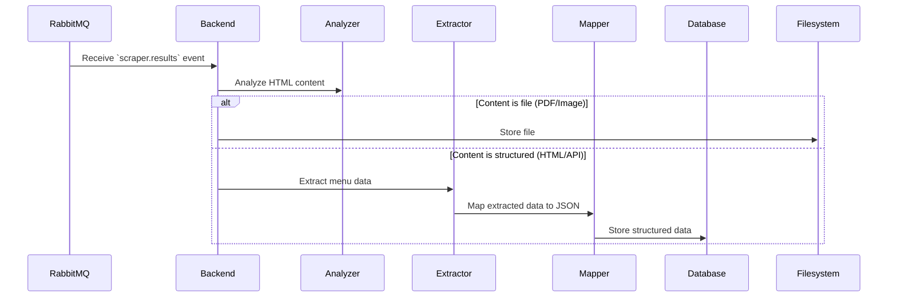

# Food-Craver

## Table of Contents

1. [Features](#-features)
2. [Prerequisites](#-prerequisites)
3. [Local Development Setup](#-local-development-setup)
4. [Local Production Setup](#-local-production-setup)
5. [Makefile Commands](#-makefile-commands)
6. [System Architecture](#system-architecture)
   - [High-Level Flow](#-high-level-flow-abstract-overview)
   - [Scraper Process](#-scraper-process-handling-pages--subpages)
   - [Backend Processing](#-backend-processing-extract-store-persist)

This project is **Food-Craver**, a web scraping system built using **NestJS**, **Puppeteer, RabbitMQ, Redis, and PostgreSQL** to extract and process menu data from various websites.

## 🚀 Features

- **Distributed Web Scraping** with **RabbitMQ** for job distribution
- **Headless Browser Automation** using **Puppeteer**
- **Caching Layer** with **Redis** to prevent redundant crawling
- **Database Persistence** with **PostgreSQL**
- **Built with NestJS** for scalable and maintainable backend logic
- **Scalable Architecture** with Docker Compose and Microservices

---

## 📌 Prerequisites

For local **development**, ensure you have the following installed:

- [Docker](https://www.docker.com/get-started)
- [Docker Compose](https://docs.docker.com/compose/install/)
- [Make](https://www.gnu.org/software/make/)
- [Yarn](https://yarnpkg.com/)
- Node.js (16+ recommended)

For simply running the **production environment**, only Docker and Docker Compose are required.

Additionally, create a `.env` file in the root directory with the following example variables:

```ini
BACKEND_IMAGE=food-craver-backend
BACKEND_DIR=packages/backend
BACKEND_PORT=3000

SCRAPER_IMAGE=food-craver-scraper
SCRAPER_DIR=packages/scraper

BROKER_IMAGE=food-craver-message-broker
BROKER_DIR=packages/message-broker
BROKER_AMQP_PORT=5672
BROKER_UI_PORT=15672
BROKER_USER=food_craver_user
BROKER_PASSWORD=password

DB_IMAGE=food-craver-database
DB_DIR=packages/database
DB_PORT=5555
DB_NAME=food_craver
DB_USER=food_craver_user
DB_PASSWORD=password

CACHE_IMAGE=food-craver-cache
CACHE_DIR=packages/cache
CACHE_PORT=6379
```

---

## 🔧 Local Development Setup

To run the project in **development mode**, follow these steps:

```sh
make install      # Install all dependencies
make build        # Build the TypeScript project
make dev          # Start the backend, scraper, and necessary containers in development mode
```

This will start the services and allow you to make live changes without restarting the application.

---

## 🚀 Local Production Setup

To run the project in **production mode**, use **Docker Compose**:

```sh
docker-compose up
```

This will:

- Build and start **all services** in detached mode (`-d`).
- Use Docker for **RabbitMQ, Redis, PostgreSQL, Scraper, and Backend**.
- Persist database and caching volumes.

To stop the services:

```sh
docker-compose down
```

To view logs:

```sh
docker-compose logs -f
```

---

## 📜 Makefile Commands

The project includes a **Makefile** for easy execution of common tasks.

| Command               | Description                                                    |
| --------------------- | -------------------------------------------------------------- |
| `make install`        | Installs npm dependencies                                      |
| `make build`          | Build the TypeScript projects and docker images                |
| `make dev`            | Start the backend, scraper, and containers in development mode |
| `make reset`          | Clean, reinstall dependencies, and rebuild the project         |
| `make clean`          | Remove node_modules, dist files, and clean up containers       |
| `make kill-container` | Stop and remove backend-related containers                     |

## System Architecture

This section outlines the architecture of the **Food Craver System**, including its overall flow, the scraping process, and backend processing.

---

### High-Level Flow (Abstract Overview)

The following diagram provides a **simplified high-level overview** of the scraper system's workflow.



#### Description

- **User submits a scraping request** via `POST /scrape`.
- **Backend sends the URLs to RabbitMQ**, which queues them as **page jobs** (`scraper.page`).
- **Scrapers retrieve jobs and process them**, rendering content and extracting subpages.
- **Discovered subpages are added as subpage jobs** (`scraper.subpage`), allowing other scrapers to process them.
- **Once scraping is complete, results are sent back to RabbitMQ** (`scraper.results`).
- **Backend processes the results**, extracts relevant data, and stores it in the **database or filesystem**.
- Finally, **the extracted data is returned to the user**.

---

### Scraper Process (Handling Pages & Subpages)

This sequence diagram details the **scraper process**, including caching, page rendering, subpage discovery, and result submission.



#### Description

1. **Scraper listens for new jobs** from `scraper.page` or `scraper.subpage`.
2. **Checks Redis cache** to see if the URL has already been crawled.
   - If **cached**, the scraper **skips processing** and acknowledges the job.
   - If **not cached**, the scraper **fetches and renders the page**.
3. **Extracts all subpages** (e.g., pagination, menu categories).
4. **Creates new subpage jobs** (`scraper.subpage`) in RabbitMQ for other scrapers to process.
5. **Caches the page content** to avoid redundant crawling.
6. **Sends the final HTML result to `scraper.results`** for backend processing.

---

### Backend Processing (Extract, Store, Persist)

This sequence diagram shows how the backend **processes scraper results**, analyzes content, extracts relevant data, and persists information.



#### Description

1. **Backend listens for results** from `scraper.results`.
2. **Analyzer determines the content type**:
   - If the content is a **file (PDF/Image)**, it is **stored in the filesystem**.
   - If the content is **structured data (HTML/API)**, it goes through further extraction.
3. **Extractor processes the structured content**, identifying relevant menu information.
4. **Mapper transforms the extracted data into a standardized JSON format**.
5. **The mapped data is persisted in the database** for retrieval and further processing.
